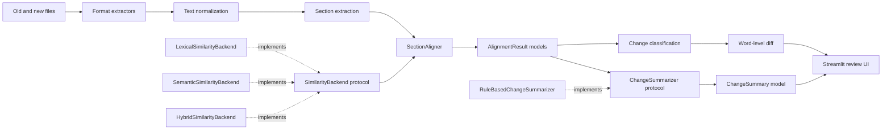

# Doc Drift Analyzer

[](https://github.com/cfuglestad/doc-drift-analyzer/actions/workflows/ci.yml)
[](https://www.python.org/downloads/)
[](LICENSE)

Compare two versions of a document and surface meaningful structural and textual changes. Upload a TXT, PDF, or DOCX file pair, and the tool aligns sections by similarity, classifies each change, and renders word-level inline diffs.

Traditional line-based diffs become noisy when prose moves, headings change, or authors reformat. Doc Drift Analyzer provides a higher-level review: compare sections first, then inspect concise classifications and word-level differences within each aligned pair.

Built for reviewing policies, procedures, contracts, and clinical guidelines where the meaning and location of changes matter more than raw line edits.

> **[Try it live →](https://doc-drift-analyzer.streamlit.app/)**

## What it does

1. Extracts text from TXT, PDF, or DOCX files
2. Splits each document into titled sections (rule-based heading detection)
3. Aligns sections between old and new versions using configurable similarity scoring
4. Classifies each pair as added, removed, unchanged, minor edit, or major edit
5. Renders word-level insertion/deletion/replacement highlighting
6. Summarizes aggregate change metrics

## Similarity backends

| Backend | How it works | When to use |
| --- | --- | --- |
| Lexical | `difflib` sequence matching | Default. Fast, deterministic, no model needed. |
| Semantic | Local sentence embeddings (`all-MiniLM-L6-v2`) | Rewrite-heavy documents where wording changes but meaning stays. |
| Hybrid | 50/50 blend of both | Tested baseline; didn't outperform pure semantic on eval set. |

All inference runs locally. Document text is never sent to an external API.

## Quick start

```bash
git clone https://github.com/cfuglestad/doc-drift-analyzer.git
cd doc-drift-analyzer
python -m venv .venv && source .venv/bin/activate
pip install -e .
streamlit run app/streamlit_app.py
```

For semantic/hybrid similarity:

```bash
pip install -e ".[semantic]"
```

Sample healthcare documents are in `sample_data/` for a quick local comparison (a medication reconciliation policy revision showing added sections, minor edits, and major rewrites).

## Tech stack

- **Python 3.12**, strict MyPy typing throughout
- **Streamlit** for the interactive review UI
- **sentence-transformers** (optional) for local semantic embeddings
- **pypdf + python-docx** for format extraction
- **pytest** with 80% branch coverage floor, enforced in CI
- **Ruff + Black** for formatting, GitHub Actions CI

## Evaluation

A labeled dataset of 5 document pairs supports reproducible benchmarking across all backends. Full methodology and results are in [`docs/evaluation/`](docs/evaluation/).

| Backend | Precision | Recall | F1 |
| --- | ---: | ---: | ---: |
| Lexical | 1.000 | 0.571 | 0.727 |
| Semantic | 0.875 | 1.000 | 0.933 |
| Hybrid | 0.875 | 1.000 | 0.933 |

## Architecture

Protocol-based dependency injection with single-responsibility modules. The Streamlit layer coordinates independently testable services; document parsing and comparison logic do not depend on the UI. Full architecture documentation and design decisions are in [`docs/architecture/`](docs/architecture/).

## Development

```bash
pip install -e ".[dev]"
pre-commit install
pytest --cov=src --cov-report=term-missing --cov-fail-under=80
```

## License

MIT

Doc Drift Analyzer is a lightweight NLP application for comparing two versions of a
document and surfacing meaningful structural and textual changes. It extracts text from
common document formats, identifies sections, aligns related content, classifies changes,
and presents an interactive review in Streamlit.

The project keeps explainable lexical comparison as its safe default and offers optional,
locally executed semantic and hybrid backends backed by reproducible evaluation.

## Motivation

Traditional line-based diffs become noisy when prose moves, headings change, or authors
reformat a document. Reviewers of policies, procedures, contracts, and internal guidance
usually care about the meaning and location of changes rather than raw line edits.

Doc Drift Analyzer provides a higher-level review workflow: compare sections first, then
inspect concise classifications and word-level differences within each aligned pair.

## Features

- TXT, PDF, and DOCX text extraction
- Rule-based section detection for all-caps and numbered headings
- Weighted lexical alignment using section titles and content
- Optional local sentence-embedding and transparent hybrid similarity
- Version-controlled alignment evaluation data and reproducible benchmarks
- Added, removed, unchanged, minor-edit, and major-edit classifications
- Inline word-level insertion, deletion, and replacement highlighting
- Concise change summaries and aggregate metrics
- Interactive Streamlit review interface
- Strict typing, automated formatting and linting, and branch-aware test coverage

## Architecture

The Streamlit layer coordinates small, independently testable services under `src/`.
Document parsing and comparison logic do not depend on the UI. Frozen domain models carry
sections, alignments, and summaries through the core pipeline, while compatibility
functions preserve the original dictionary-based APIs.



| Component | Responsibility |
| --- | --- |
| `src/extractors.py` | Extract text from TXT, PDF, and DOCX inputs. |
| `src/text_utils.py` | Normalize text and split paragraphs or sentences. |
| `src/sectioning.py` | Convert document text into titled sections. |
| `src/similarity.py` | Define lexical and weighted hybrid similarity behavior. |
| `src/semantic.py` | Adapt an optional local sentence-embedding model. |
| `src/config.py` | Select backends, thresholds, and observable fallback explicitly. |
| `src/alignment.py` | Match sections using an explicitly injected similarity backend. |
| `src/diffing.py` | Classify changes, count results, and render inline diffs. |
| `src/summarization.py` | Define summarization behavior and deterministic defaults. |
| `src/models.py` | Provide immutable domain models and compatibility adapters. |
| `src/evaluation/` | Load labeled data and calculate deterministic accuracy metrics. |
| `src/benchmark.py` | Measure non-blocking backend performance observations. |
| `app/streamlit_app.py` | Orchestrate the comparison workflow and render the UI. |

`SimilarityBackend` has one responsibility: scoring two strings. `SectionAligner` owns
pairing, thresholding, and added/removed detection. `ChangeSummarizer` converts typed
alignment results into counts and bullets; `RuleBasedChangeSummarizer` preserves the
current deterministic wording. This separation allows a future semantic scorer to replace
the lexical backend without changing alignment or presentation logic.

Constructor injection keeps backend selection explicit:

```python
from src.alignment import SectionAligner
from src.models import Section
from src.similarity import LexicalSimilarityBackend

aligner = SectionAligner(similarity_backend=LexicalSimilarityBackend())
results = aligner.align(
    [Section(title="Policy", content="Keep records.")],
    [Section(title="Policy", content="Keep all records.")],
    threshold=0.35,
)
```

See [the Phase 2 design note](docs/architecture/phase-2-interfaces.md) for the interface
boundaries and rationale and [the Phase 3 design note](docs/architecture/phase-3-semantic-alignment.md)
for semantic lifecycle, fallback, privacy, and deployment decisions.

### Available backends

| Backend | Score | Recommended threshold | Notes |
| --- | --- | ---: | --- |
| Lexical | `difflib` ratio in `[0, 1]` | `0.35` | Default; deterministic and dependency-light. |
| Semantic | affine-normalized cosine in `[0, 1]` | `0.65` | Best evaluated recall/F1; optional local model. |
| Hybrid | 50% lexical + 50% semantic | `0.50` | Tested baseline; did not outperform semantic. |

Thresholds are backend-specific because the score distributions are not interchangeable.
The lexical default remains `0.35` for backward compatibility even though `0.40` performed
slightly better on the small Phase 3 evaluation set.

## Installation

Doc Drift Analyzer requires Python 3.12 or newer.

```bash
git clone https://github.com/cfuglestad/doc-drift-analyzer.git
cd doc-drift-analyzer
python -m venv .venv
```

Activate the environment on macOS or Linux:

```bash
source .venv/bin/activate
```

Or on Windows PowerShell:

```powershell
.venv\Scripts\Activate.ps1
```

Install the lexical-only application:

```bash
python -m pip install --upgrade pip
python -m pip install -e .
```

To enable local semantic and hybrid similarity, install the optional model stack:

```bash
python -m pip install -e ".[semantic]"
```

The first semantic use downloads `sentence-transformers/all-MiniLM-L6-v2` unless it is
already cached or `model_identifier` points to a local model directory. The evaluated cache
occupied approximately 87 MiB; PyTorch and related dependencies make the full environment
substantially larger.

## Usage

Start the Streamlit application from the repository root:

```bash
streamlit run app/streamlit_app.py
```

Then:

1. Upload an old and a new TXT, PDF, or DOCX document.
2. Select lexical, semantic, or hybrid similarity. Lexical remains selected by default.
3. Adjust the backend-specific section alignment threshold if needed.
4. Select **Compare documents**.
5. Review the active backend, aggregate counts, key changes, and section-level inline diffs.

If semantic initialization fails and fallback is enabled, the application displays a
warning and uses lexical similarity at its established threshold. Evaluation commands use
strict mode and never hide semantic failures behind fallback.

Example documents are available in `sample_data/` for a quick local comparison.

## Screenshots

> Screenshot placeholder: an application overview and detailed diff example will be added
> as the interface stabilizes.

## Development setup

Install the project with its development toolchain and enable commit hooks:

```bash
python -m pip install -e ".[dev]"
pre-commit install
```

The repository uses Ruff for linting and import ordering, Black for formatting, MyPy for
strict static analysis, pytest for tests, and coverage.py for branch coverage. The same
checks run in GitHub Actions through the shared `cfuglestad/github-workflows` Python
workflow.

Run individual quality checks with:

```bash
ruff check .
black --check .
mypy src
pytest
```

See [CONTRIBUTING.md](CONTRIBUTING.md) for contribution expectations and the pull request
workflow.

## Testing

Run the complete suite with terminal coverage details:

```bash
pytest --cov=src --cov-report=term-missing --cov-fail-under=80
```

Tests emphasize section alignment, section extraction, diff classification and rendering,
format-specific extraction, summarization, and text normalization. CI enforces a minimum
of 80% coverage.

Run accuracy evaluation and performance benchmarks from the repository root:

```bash
python -m src.evaluation --backend lexical --output evaluation/results/lexical.json
python -m src.evaluation --backend semantic --output evaluation/results/semantic.json
python -m src.evaluation --backend hybrid --output evaluation/results/hybrid.json
python -m src.benchmark --backend semantic --threshold 0.65 --rounds 5
```

Semantic commands require the `semantic` extra. Timings are machine-sensitive observations
and do not block normal CI. See the [generated evaluation report](docs/evaluation/alignment-benchmark.md)
for metric definitions, environment details, and complete results.

## Evaluation summary

The synthetic Phase 3 dataset contains five document pairs and explicitly labels matched,
added, removed, ambiguous, split, and merged relationships. Unsupported ambiguous and
many-to-many cases are reported separately rather than counted as ordinary one-to-one
errors.

| Backend | Threshold | Precision | Recall | F1 | Exact pair accuracy |
| --- | ---: | ---: | ---: | ---: | ---: |
| Lexical | `0.40` | 1.000 | 0.571 | 0.727 | 0.600 |
| Semantic | `0.65` | 0.875 | 1.000 | 0.933 | 0.800 |
| Hybrid | `0.50` | 0.875 | 1.000 | 0.933 | 0.800 |

Semantic is recommended for rewrite-heavy analysis when the optional local model is
acceptable. Hybrid adds cost without improving this dataset. Lexical remains the default
because it is fast, deterministic, backward-compatible, and needs no model runtime. These
results are directional: the dataset is deliberately small and is not a production claim.

## Privacy and deployment

Semantic inference runs locally; uploaded document text is not sent to an embedding or LLM
API and is never logged by the backend. Model downloads may access Hugging Face during
installation or first use, but cached model files do not contain uploaded documents.

Local inference adds cold-start latency, memory use, model-cache storage, and container
size. CPU-only execution works but is materially slower than lexical comparison. Offline
deployments must pre-populate the model cache or configure a local model path. Streamlit
caches one backend resource per process; multi-process deployments may hold multiple model
copies. GPU acceleration is left to the model runtime and is not configured by this project.

## Roadmap

- [x] Modern Python packaging and automated quality gates
- [x] Focused tests for the core document comparison pipeline
- [x] Define stable alignment and summarization interfaces
- [x] Introduce a configurable similarity backend
- [x] Add evaluated embedding-based semantic alignment alongside lexical alignment
- [ ] Improve heading detection and support nested document structure
- [ ] Add exportable comparison reports
- [x] Add an initial benchmark and labeled evaluation dataset

## Future improvements

The next phase should expand the labeled corpus before tuning thresholds further, add
confidence and abstention behavior, improve embedding batching for larger documents, and
investigate split/merge-aware alignment without replacing the deterministic one-to-one
baseline. Additional work includes HTML-safe diff rendering, large-document performance
tests, and exportable reports.

## License

Doc Drift Analyzer is available under the [MIT License](LICENSE).
