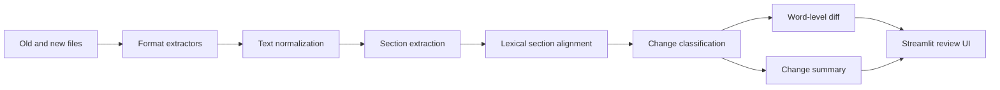

# Doc Drift Analyzer

[](https://github.com/cfuglestad/doc-drift-analyzer/actions/workflows/ci.yml)
[](https://www.python.org/downloads/)
[](LICENSE)

Doc Drift Analyzer is a lightweight NLP application for comparing two versions of a
document and surfacing meaningful structural and textual changes. It extracts text from
common document formats, identifies sections, aligns related content, classifies changes,
and presents an interactive review in Streamlit.

The project favors explainable lexical methods today while maintaining a focused,
testable core that can evolve toward semantic similarity and richer NLP backends.

## Motivation

Traditional line-based diffs become noisy when prose moves, headings change, or authors
reformat a document. Reviewers of policies, procedures, contracts, and internal guidance
usually care about the meaning and location of changes rather than raw line edits.

Doc Drift Analyzer provides a higher-level review workflow: compare sections first, then
inspect concise classifications and word-level differences within each aligned pair.

## Features

- TXT, PDF, and DOCX text extraction
- Rule-based section detection for all-caps and numbered headings
- Weighted lexical alignment using section titles and content
- Added, removed, unchanged, minor-edit, and major-edit classifications
- Inline word-level insertion, deletion, and replacement highlighting
- Concise change summaries and aggregate metrics
- Interactive Streamlit review interface
- Strict typing, automated formatting and linting, and branch-aware test coverage

## Architecture

The Streamlit layer coordinates small, independently testable modules under `src/`.
Document parsing and comparison logic do not depend on the UI, keeping future API or CLI
adapters practical.



| Component | Responsibility |
| --- | --- |
| `src/extractors.py` | Extract text from TXT, PDF, and DOCX inputs. |
| `src/text_utils.py` | Normalize text and split paragraphs or sentences. |
| `src/sectioning.py` | Convert document text into titled sections. |
| `src/alignment.py` | Match old sections to new sections with lexical similarity. |
| `src/diffing.py` | Classify changes, count results, and render inline diffs. |
| `src/summarization.py` | Produce concise human-readable change bullets. |
| `app/streamlit_app.py` | Orchestrate the comparison workflow and render the UI. |

## Installation

Doc Drift Analyzer requires Python 3.12 or newer.

```bash
git clone https://github.com/cfuglestad/doc-drift-analyzer.git
cd doc-drift-analyzer
python -m venv .venv
```

Activate the environment on macOS or Linux:

```bash
source .venv/bin/activate
```

Or on Windows PowerShell:

```powershell
.venv\Scripts\Activate.ps1
```

Install the application:

```bash
python -m pip install --upgrade pip
python -m pip install -e .
```

## Usage

Start the Streamlit application from the repository root:

```bash
streamlit run app/streamlit_app.py
```

Then:

1. Upload an old and a new TXT, PDF, or DOCX document.
2. Adjust the section alignment threshold if the documents differ substantially.
3. Select **Compare documents**.
4. Review aggregate counts, key changes, and section-level inline diffs.

Example documents are available in `sample_data/` for a quick local comparison.

## Screenshots

> Screenshot placeholder: an application overview and detailed diff example will be added
> as the interface stabilizes.

## Development setup

Install the project with its development toolchain and enable commit hooks:

```bash
python -m pip install -e ".[dev]"
pre-commit install
```

The repository uses Ruff for linting and import ordering, Black for formatting, MyPy for
strict static analysis, pytest for tests, and coverage.py for branch coverage. The same
checks run in GitHub Actions through the shared `cfuglestad/github-workflows` Python
workflow.

Run individual quality checks with:

```bash
ruff check .
black --check .
mypy src
pytest
```

See [CONTRIBUTING.md](CONTRIBUTING.md) for contribution expectations and the pull request
workflow.

## Testing

Run the complete suite with terminal coverage details:

```bash
pytest --cov=src --cov-report=term-missing --cov-fail-under=80
```

Tests emphasize section alignment, section extraction, diff classification and rendering,
format-specific extraction, summarization, and text normalization. CI enforces a minimum
of 80% coverage.

## Roadmap

- [x] Modern Python packaging and automated quality gates
- [x] Focused tests for the core document comparison pipeline
- [ ] Define stable alignment and summarization interfaces
- [ ] Introduce a configurable similarity backend
- [ ] Add embedding-based semantic alignment alongside lexical alignment
- [ ] Improve heading detection and support nested document structure
- [ ] Add exportable comparison reports
- [ ] Add representative benchmark and evaluation datasets

## Future improvements

The next architectural phase will separate similarity scoring from alignment policy so the
current `difflib` implementation can be exchanged for embedding-based similarity without
coupling the core workflow to a specific model. Future work should also introduce explicit
evaluation metrics, confidence reporting, large-document performance tests, and additional
input adapters while preserving deterministic lexical behavior as a baseline.

## License

Doc Drift Analyzer is available under the [MIT License](LICENSE).
